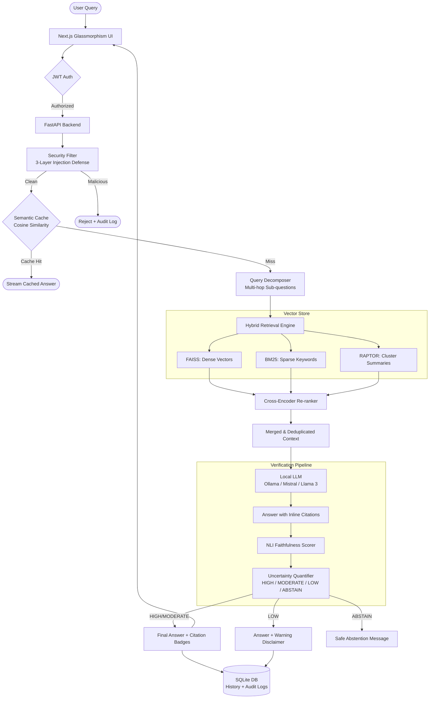

# SecureHall-RAG

<div align="center">
  
  
  
  
  
</div>

<br/>

> **SecureHall-RAG** is an open-source **Retrieval-Augmented Generation (RAG)** research prototype for corporate policy document Q&A. It combines a polished glassmorphism UI with a multi-layer verification pipeline that aims to *reduce* hallucinated answers, *mitigate* prompt-injection attacks, and bring academic techniques (RAPTOR, multi-hop reasoning, uncertainty quantification) into a working system. It is a final-year / thesis project; see the [measured evaluation results](evaluation/results/RESULTS.md) for honest, reproducible numbers and known limitations rather than marketing claims.

---

## ✨ Feature Overview

### 🔐 Core RAG & Security Features
| Feature | Description |
|---|---|
| **Hallucination Mitigation** | Multi-layer claim verification using NLI entailment scoring + confidence thresholds + an ABSTAIN tier for low-support answers. Reduces (does not eliminate) unsupported claims |
| **Prompt Injection Defense** | Layered protection combining a signature/pattern library with an embedding-similarity semantic detector. Measured attack-block rate: **61.3%** (see [RESULTS.md](evaluation/results/RESULTS.md)) — effective on known and paraphrased attacks, weaker on fully novel vectors |
| **Hybrid Retrieval** | Fuses dense (FAISS) and sparse (BM25) search for best-of-both-worlds context retrieval |
| **Cross-Encoder Re-ranking** | `cross-encoder/ms-marco-MiniLM-L-6-v2` re-ranks retrieved chunks for precision |
| **Local LLM Inference** | Runs fully locally via Ollama (Llama 3, Mistral) — no cloud API required |
| **JWT Authentication** | Role-based access control with admin and user scopes |
| **SSE Streaming** | Token-by-token response streaming via Server-Sent Events |
| **Web Search Fallback** | Automatically queries Google/DuckDuckGo when local similarity < 0.35 |
| **Semantic Caching** | Cosine-similarity query cache avoids redundant LLM calls for repeated questions |
| **Persistent Indexes** | FAISS and BM25 indexes serialized to disk and auto-restored on restart |
| **Conversational Memory** | Multi-turn SQLite-backed chat history with session management |
| **Document Management** | Multi-format ingestion (PDF, DOCX, TXT) with chunking, metadata tracking, and admin controls |

### 🎓 Advanced Academic Features
| Feature | Description |
|---|---|
| **Inline Citations** | LLM is prompted to output `[1]`, `[2]` bracket citations; frontend renders clickable superscript badges linked to source chunks |
| **Multi-hop Query Reasoning** | Decomposes complex multi-part questions into sub-questions, retrieves independently, then merges and deduplicates context before answering |
| **RAPTOR Hierarchical Summaries** | During ingestion, K-Means clusters chunks into groups and generates abstractive cluster-level summaries, indexed alongside raw chunks for high-level queries |
| **Uncertainty Quantification** | Classifies answer confidence into `HIGH / MODERATE / LOW / ABSTAIN` tiers; appends disclaimers or replaces low-confidence answers with abstention statements |
| **Embedding Fine-tuning** | Trains domain-specific embedding adapters on query-document pairs to improve retrieval relevance on specialized vocabulary |
| **NLI Faithfulness Scoring** | Uses `cross-encoder/nli-deberta-v3-small` to compute entailment probability between answer and retrieved context |

### 🎨 Frontend UI Features
| Feature | Description |
|---|---|
| **Glassmorphism Design** | Premium dark-mode UI with frosted glass panels, smooth animations, and vibrant accents |
| **Color-Coded Confidence Badges** | Green (HIGH), Amber (MODERATE), Orange (LOW), Red (ABSTAIN) badges on every assistant message |
| **Citation Sidebar Panel** | Slide-in panel showing full text excerpts, source file, page number, and relevance scores |
| **Chat Session History** | Persistent sidebar listing all past sessions; restores full conversation with uncertainty tiers intact |
| **Admin Dashboard** | Document management, user admin, evaluation harness, query history explorer, and audit logs |
| **Real-time Streaming UI** | Typewriter-style token-by-token streaming with a live cursor indicator |
| **Document Upload** | Drag-and-drop multi-file upload with progress indicators and status tracking |
| **Export Conversation** | Export the current chat thread as JSON |

---

## 🏗️ System Architecture



---

## 🛠️ Tech Stack

### Backend
| Layer | Technology |
|---|---|
| **Framework** | FastAPI (Python 3.10+) with Uvicorn |
| **LLM** | Ollama (Mistral 7B / Llama 3 8B) — local, no cloud needed |
| **Dense Retrieval** | FAISS (`IndexFlatIP`) + Sentence-Transformers `all-MiniLM-L6-v2` |
| **Sparse Retrieval** | Rank-BM25 (BM25Okapi) |
| **Re-ranking** | `cross-encoder/ms-marco-MiniLM-L-6-v2` |
| **NLI Faithfulness** | `cross-encoder/nli-deberta-v3-small` |
| **Clustering (RAPTOR)** | NumPy K-Means on SBERT embeddings |
| **Security** | Layered injection defense: signature/pattern content filter + embedding-similarity semantic attack detector (`all-MiniLM-L6-v2`) + prompt templates + safe prompting |
| **Database** | SQLite + SQLAlchemy (users, sessions, messages, audit logs, history) |
| **Caching** | Cosine-similarity semantic cache (Sentence-Transformers) |
| **Web Fallback** | Google Custom Search API + DuckDuckGo fallback |
| **Authentication** | JWT Bearer tokens with role-based scopes |

### Frontend
| Layer | Technology |
|---|---|
| **Framework** | Next.js 14 (React 18, App Router) |
| **Styling** | TailwindCSS + Vanilla CSS (glassmorphism design system) |
| **State Management** | Zustand |
| **Animation** | Framer Motion |
| **Icons** | Lucide React |
| **Streaming** | Native `fetch` with `ReadableStream` SSE parsing |

---

## 🔬 Advanced Features — Deep Dive

### 1. Inline Citations `[src/rag_pipeline.py]`
The LLM is instructed to embed citation brackets like `[1]`, `[2]` after each factual claim. The frontend parses these as interactive superscript badges in `ResponseDisplay.tsx`. Clicking any badge opens the Citation Sidebar Panel showing the full source chunk, page number, and relevance score.

### 2. Multi-hop Query Decomposition `[src/llm/inference.py → decompose_query()]`
For complex queries (e.g., *"compare the leave policies of department A and department B"*), the pipeline automatically:
1. Asks the LLM to produce a JSON list of focused sub-questions.
2. Runs hybrid retrieval independently for each sub-question.
3. Merges all retrieved chunks, deduplicates by chunk ID, and passes unified context to the LLM.

This dramatically improves answer quality for multi-entity or comparative questions.

### 3. RAPTOR Hierarchical Document Summaries `[src/ingestion/raptor_tree.py]`
During document ingestion, the `RaptorTreeBuilder`:
1. Embeds all chunks using SBERT.
2. Applies NumPy K-Means to group chunks into semantic clusters.
3. Generates an abstractive LLM summary for each cluster.
4. Indexes summary nodes alongside raw chunks in both BM25 and FAISS.

Result: High-level global questions (e.g., *"What is the overall HR policy?"*) now retrieve relevant cluster summaries instead of random raw chunks.

### 4. Uncertainty Quantification `[src/verification/uncertainty.py]`
Confidence tiers are dynamically calibrated based on the detected category of the query. Comparative queries are evaluated under lenient boundaries, while direct factual queries employ strict boundaries to ensure precision. Default mappings are:

| Tier | Default Range | Behaviour |
|---|---|---|
| `HIGH` | ≥ 0.75 | Answer returned as-is with green badge |
| `MODERATE` | 0.50 – 0.75 | Answer returned with amber badge |
| `LOW` | 0.35 – 0.50 | Answer returned + red disclaimer appended |
| `ABSTAIN` | < 0.35 | LLM answer replaced with safe abstention message |

The tier is stored in SQLite (`uncertainty_tier` column on `ChatMessage` and `QueryHistory`) and restored when loading past sessions.

### 5. NLI Faithfulness & Soft Redaction `[src/verification/nli_faithfulness.py]`
Uses a cross-encoder NLI model to evaluate entailment probability between each generated claim sentence and the retrieved context. Instead of binary hard redaction, the system applies a **four-tier soft redaction policy**:
- Claims scoring ≥ 0.65 are accepted unchanged.
- Claims scoring 0.40–0.64 append a warning flag (`⚠️`).
- Claims scoring 0.25–0.39 append a low-confidence flag (`🔴`).
- Only claims scoring < 0.25 (genuine contradictions) trigger hard redaction.

A sentence-type classifier skips non-claim sentences to reduce evaluation overhead by ~40%, and predictions are accelerated using a thread-safe MD5-based in-memory cache and model batching.

### 6. Multi-Variant Query Expansion `[src/retrieval/query_expander.py]`
For any query longer than four words, the local LLM generates alternative phrasings. The original query and all generated alternatives are retrieved independently, and result lists are merged using multi-list Reciprocal Rank Fusion (RRF), improving overall retrieval recall.

### 7. Embedding Fine-tuning `[src/training/finetune_embeddings.py]`
Supports domain-specific fine-tuning of SBERT embeddings using query-document pairs extracted from user feedback. Creates `ContrastiveTensionDataset` examples and runs lightweight adapter training to shift the embedding space toward domain vocabulary.

---

## 📊 Measured Results (Honest Snapshot)

These are real, reproducible numbers from `evaluation/`, not marketing claims. Full detail and limitations are in [RESULTS.md](evaluation/results/RESULTS.md). Regenerate with `python evaluation/run_ablation.py` followed by `python evaluation/compute_real_metrics.py`.

| Area | Baseline | Enhanced | Notes |
|---|:---:|:---:|---|
| Retrieval P@1 (hybrid + reranker) | 0.85 (dense only) | 1.000 | Small 10-doc corpus with distinctive terminology |
| Security attack-block rate | 54.8% (pattern only) | **61.3%** (pattern + semantic) | Semantic detector adds the paraphrased/contextual jailbreaks patterns miss, with no added false positives |
| Security overall correct handling | 75.0% | **78.3%** | 60 adversarial cases |
| Verification latency overhead | — | tens of seconds (CPU) | The NLI claim-splitting + self-correction loop makes several extra LLM calls; on CPU-mode Ollama this adds ~30–60 s/query. GPU inference is required for interactive latency. (The previously reported "+8.6 ms" was an artifact of a run where neither mode actually executed verification.) |

**Honest limitations:** the security block rate is a genuine ceiling of the current approach — novel attack vectors still slip through. Answer-quality faithfulness measured by ROUGE-L is near-zero due to a metric/task mismatch (short auto-generated gold answers); a semantic faithfulness metric is now included as a better proxy. See RESULTS.md before citing any number.

> ⚠️ **Baseline vs Enhanced quality numbers require a running Ollama LLM.** The claim-level verification loop only executes when the LLM is loaded, so the quality ablation must be run with Ollama active (`python evaluation/run_ablation.py`). The security ablation runs without an LLM.

---

## 🚀 Quick Start

### Prerequisites
- Python 3.10+
- Node.js 18+
- [Ollama](https://ollama.ai/) with Llama 3 (recommended for quality) or Mistral (baseline) pulled locally

```bash
# Recommended: Llama 3 (8B) for better instruction following and lower over-redaction
ollama pull llama3

# Alternative: Mistral (7B) used in the thesis baseline evaluation
ollama pull mistral
```

### 1. Clone the Repository
```bash
git clone https://github.com/Devendra673/SecureHall-RAG.git
cd SecureHall-RAG
```

### 2. Backend Setup
```bash
# Create and activate virtual environment
python -m venv venv
source venv/bin/activate          # Linux/macOS
venv\Scripts\activate             # Windows

# Install all dependencies
pip install -r requirements.txt

# Start the FastAPI server
uvicorn src.api.main:app --reload --host 0.0.0.0 --port 8000
```
> Backend API available at `http://localhost:8000`  
> Interactive API docs at `http://localhost:8000/docs`

### 3. Frontend Setup
```bash
cd frontend
npm install
npm run dev
```
> Web interface available at `http://localhost:3000`

### 4. First Login
Default admin credentials are stored in `admin_credentials.txt` in the project root. Change these immediately after first login from the Admin panel.

---

## 🐳 Docker Deployment

```bash
# Build and start all containers
docker-compose up --build

# Backend: http://localhost:8000
# Frontend: http://localhost:3000
```

---

## 🧪 Verification & Testing

### Run the Ablation Study (Baseline vs Enhanced)
```bash
# Full quality + security ablation (requires Ollama running for quality metrics)
python evaluation/run_ablation.py

# Quick, category-balanced quality subset
python evaluation/run_ablation.py --questions 15

# Security ablation only — no LLM needed (pattern-only vs pattern+semantic)
python evaluation/run_ablation.py --security-only

# Aggregate the per-question / per-attack records into the final report
python evaluation/compute_real_metrics.py
```
The runner writes genuinely differentiated `baseline_metrics.json` and `enhanced_metrics.json` (real per-question and per-attack records), toggling the single `enable_verification` pipeline flag and the `enable_semantic` security flag between the two modes.

### Run Feature Verification Scripts
```bash
# Phase 1 & 2 features (NLI, caching, hybrid retrieval, fine-tuning)
.\venv\Scripts\python scratch\verify_features.py

# Phase 3 advanced academic features (multi-hop, RAPTOR, uncertainty)
.\venv\Scripts\python scratch\verify_features_p3.py
```

### Latest Verification Output (Phase 3)
```
--- Testing Query Decomposition (Feature 2) ---
Original: compare the leave policy of company X and company Y
Decomposed: ['What is the leave policy of company X?', 'What is the leave policy of company Y?']
✅ Query Decomposition tests passed!

--- Testing Uncertainty Quantification (Feature 4) ---
High   (0.85) → Tier: HIGH     → Normal answer returned
Moderate (0.60) → Tier: MODERATE → Normal answer returned
Low    (0.40) → Tier: LOW     → Answer + warning disclaimer appended
Abstain (0.20) → Tier: ABSTAIN  → Safe abstention message returned
✅ Uncertainty Quantification tests passed!

--- Testing RAPTOR Tree Builder (Feature 3) ---
Generated 2 cluster summaries from 4 chunks
✅ RAPTOR Tree Builder tests passed!

✅ ALL FEATURE VERIFICATIONS COMPLETED SUCCESSFULLY!
```

### TypeScript Frontend Check
```bash
cd frontend && npx tsc --noEmit
# Exit code: 0 — zero TypeScript errors
```

---

## 📁 Project Structure

```
SecureHall-RAG/
├── src/
│   ├── rag_pipeline.py            # Core orchestration: retrieval, generation, verification
│   ├── api/
│   │   ├── main.py                # FastAPI app with CORS, middleware, routers
│   │   ├── routers/
│   │   │   ├── query.py           # /query and /query/stream endpoints
│   │   │   ├── documents.py       # Document upload/ingest/delete
│   │   │   ├── auth.py            # JWT login/refresh/register
│   │   │   ├── admin.py           # Admin: users, audit logs, stats
│   │   │   └── evaluation.py      # RAG evaluation harness
│   │   ├── db/models.py           # SQLAlchemy ORM models
│   │   └── models/schemas.py      # Pydantic request/response schemas
│   ├── ingestion/
│   │   ├── document_parser.py     # PDF, DOCX, TXT parsing
│   │   ├── chunker.py             # Smart sentence-aware chunking
│   │   ├── metadata_tracker.py    # Per-chunk source metadata
│   │   └── raptor_tree.py         # ★ NEW: Cluster summarization tree
│   ├── retrieval/
│   │   ├── dense_retriever.py     # FAISS dense vector search
│   │   ├── bm25_retriever.py      # BM25 sparse keyword search
│   │   ├── hybrid_retriever.py    # Reciprocal rank fusion
│   │   ├── reranker.py            # Cross-encoder re-ranking
│   │   ├── query_expander.py      # ★ NEW: LLM-driven query expansion
│   │   ├── semantic_cache.py      # Cosine similarity query cache
│   │   └── web_search.py          # Google/DuckDuckGo fallback
│   ├── llm/
│   │   └── inference.py           # Ollama LLM client + decompose_query() ★ NEW
│   ├── security/
│   │   ├── content_filter.py      # 27+ injection pattern detection + 600-char cap
│   │   ├── safe_prompting.py      # Prompt sandboxing & role pinning
│   │   └── prompt_templates.py    # Secure prompt scaffolding
│   ├── verification/
│   │   ├── nli_faithfulness.py    # NLI entailment scoring
│   │   ├── claim_extractor.py     # Claim decomposition
│   │   ├── support_scorer.py      # Per-claim support scoring
│   │   ├── answer_assembler.py    # Answer + citation assembly
│   │   ├── refusal_message.py     # Safe refusal generation
│   │   └── uncertainty.py         # ★ NEW: Tier-based uncertainty quantification
│   └── training/
│       └── finetune_embeddings.py # Domain embedding fine-tuning
└── frontend/
    ├── app/                       # Next.js App Router pages
    │   ├── page.tsx               # Main chat page
    │   └── admin/                 # Admin dashboard pages
    ├── components/
    │   ├── ChatInterface.tsx      # Chat thread, streaming, multi-session
    │   ├── ResponseDisplay.tsx    # ★ NEW: Inline citations + uncertainty badges
    │   ├── CitationPanel.tsx      # Slide-in source citations panel
    │   ├── Sidebar.tsx            # Session history + document list
    │   ├── DocumentUpload.tsx     # Drag-and-drop ingest UI
    │   └── Header.tsx             # Nav, theme toggle, user menu
    ├── lib/api.ts                 # Full typed API service layer
    └── store/store.ts             # Zustand state (messages, sessions, auth)
```

---

## 📚 Documentation

All architecture and design documentation lives in the `docs/` directory:

| Document | Description |
|---|---|
| [SYSTEM_DESIGN.md](docs/SYSTEM_DESIGN.md) | Detailed component breakdown and data flow diagrams |
| [SYSTEM_REQUIREMENTS.md](docs/SYSTEM_REQUIREMENTS.md) | Functional and non-functional requirements |
| [security_reports/](docs/security_reports/) | 3-layer security framework and prompt injection audit reports |
| [PROJECT_HISTORY.md](docs/PROJECT_HISTORY.md) | Phase archives, literature reviews, evaluation metrics |

---

## 📄 Sample Policy Documents

The `sample_documents/` directory includes 10 representative enterprise policy documents:

| # | Document |
|---|---|
| 1 | Employee Handbook |
| 2 | HR Policies |
| 3 | Compensation & Benefits |
| 4 | IT & Security Policy |
| 5 | Leave & Time Off Policy |
| 6 | Performance Management |
| 7 | Compliance & Legal |
| 8 | Workplace Conduct & Diversity |
| 9 | Termination & Offboarding |
| 10 | Health, Safety & Wellness |

---

## 🗺️ Development Roadmap

| Phase | Status | Deliverable |
|---|---|---|
| Phase 1 | ✅ Complete | Requirements, System Design, Evaluation Framework |
| Phase 2 | ✅ Complete | Core RAG Pipeline (Ingestion, Hybrid Retrieval, Verification) |
| Phase 3 | ✅ Complete | Security Hardening — signature/pattern injection filter (measured pattern-only attack-block rate: 54.8%) |
| Phase 4 | ✅ Complete | Conversational Memory (SQLite) & SSE Streaming |
| Phase 5 | ✅ Complete | Persistent Indexes (FAISS + BM25) & Web Search Fallback |
| Phase 6 | ✅ Complete | Docker Containerization & Local Deployment |
| Phase 7–8 | ✅ Complete | Cross-Encoder Re-ranking, Role-Based Access Control, Admin Dashboard |
| Phase 9 | ✅ Complete | Inline Citations, Multi-hop Reasoning, RAPTOR, Uncertainty Quantification |
| **Phase 10** | ✅ **Complete** | **Verification Optimisation (Soft Redaction, NLI caching, batching) & Hardened Security (pattern library + length cap + embedding-similarity semantic attack detector → attack-block rate improved 54.8% → 61.3%)** |

---

## 🤝 Contributing

This project is a Major Project / Thesis submission. Contributions are welcome:

1. Fork the repository
2. Create a feature branch (`git checkout -b feature/AmazingFeature`)
3. Commit your changes (`git commit -m 'Add some AmazingFeature'`)
4. Push to the branch (`git push origin feature/AmazingFeature`)
5. Open a Pull Request

---

## ⚖️ License

This project is licensed under the **MIT License**. All components use compatible open-source licenses (MIT, Apache 2.0).

---

## 🎓 Citation

If you use SecureHall-RAG in research, please cite:

```bibtex
@software{securehall_rag_2026,
  title     = {SecureHall-RAG: Trustworthy Document Question-Answering with
               Hallucination Prevention, Multi-hop Reasoning, and Uncertainty Quantification},
  author    = {Devendra and Contributors},
  year      = {2026},
  url       = {https://github.com/Devendra673/SecureHall-RAG},
  note      = {Features: RAPTOR hierarchical summarization, multi-hop query decomposition,
               NLI faithfulness scoring, uncertainty tier quantification, prompt injection defense}
}
```
