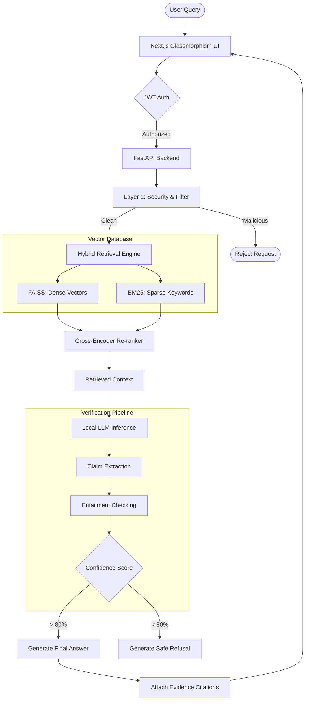

SecureHall-RAG is an open-source, enterprise-grade **Retrieval-Augmented Generation (RAG)** system designed specifically for corporate policy document Q&A. It combines a highly polished UI with an advanced backend verification pipeline to prevent "hallucinated" answers and defend against malicious prompt injection attacks.

---

## ✨ Key Features

*   🎯 **Zero Hallucination Tolerance:** Implements a strict multi-layer claim verification pipeline. Answers are scored for confidence, and unsupported claims are rejected.
*   🛡️ **Enterprise Security-First:** Defends against 17+ known prompt injection techniques, data exfiltration attempts, and SQL injections using a 3-layer security framework.
*   🎨 **Premium UI/UX:** A stunning, fully responsive Next.js frontend featuring modern glassmorphism aesthetics, dark mode, and fluid animations.
*   🔒 **Local Deployment:** No cloud API dependency required. Your sensitive corporate documents never leave your local environment.
*   📊 **Evidence Chains:** Every AI response includes exact citations to the source document, providing complete transparency into how the answer was generated.
*   💬 **Database-Backed Conversational Memory:** Retains multi-turn dialogue history in an SQLite database, allowing the assistant to resolve follow-up questions.
*   ⚡ **Real-Time SSE Streaming:** Pushes model generation outputs token-by-token directly to the user interface using Server-Sent Events (SSE).
*   💾 **Persistent FAISS & BM25 Indexes:** Serializes vector and sparse search indexes to local storage, automatically recovering the index state across system reboots.
*   🌐 **Web Search Fallback Engine:** Automatically queries the public internet (Google Custom Search or DuckDuckGo) when local similarity scores drop below 0.35, synthesizing external web results with full URL citations.
*   🐳 **Containerized Local Deployment:** Fully dockerized backend (FastAPI) and frontend (Next.js) orchestrated with Docker Compose, utilizing optimized CPU-only PyTorch builds.

---

## 🏗️ System Architecture

The following diagram illustrates the flow of a user query through the secure pipeline:



---

## 🛠️ Tech Stack

### Frontend
*   **Framework:** Next.js (React 18)
*   **Styling:** TailwindCSS + Vanilla CSS (Glassmorphism design language)
*   **State Management:** Zustand
*   **Icons:** Lucide React

### Backend
*   **Framework:** FastAPI (Python 3.10+)
*   **LLM Inference:** Ollama / Mistral / Llama 3
*   **Retrieval:** FAISS (Dense Search) + Rank-BM25 (Sparse Search)
*   **Embeddings:** Sentence-Transformers (`all-MiniLM-L6-v2`)
*   **Database:** SQLite & SQLAlchemy (Auth & Metadata)

---

## 🚀 Quick Start

### 1. Clone the Repository
```bash
git clone https://github.com/Devendra673/SecureHall-RAG.git
cd SecureHall-RAG
```

### 2. Start the Backend API (FastAPI)
```bash
# Create and activate virtual environment
python -m venv venv
source venv/bin/activate  # Windows: venv\Scripts\activate

# Install dependencies
pip install -r requirements.txt

# Start the server
uvicorn src.api.main:app --reload
```
*The backend API will run on `http://localhost:8000`*

### 3. Start the Frontend (Next.js)
```bash
cd frontend

# Install Node dependencies
npm install

# Start the development server
npm run dev
```
*The web interface will be available at `http://localhost:3000`*

---

## 🧪 Testing

**Current Test Results**:
- **Total Tests**: 417+ passing ✅
- **Coverage**: >95% across all modules
- **Execution Time**: ~5 minutes

**Test Suites**:
- Document parsing & chunking (Phase 2)
- Retrieval components (dense, sparse, hybrid)
- Security filters & pattern detection (Phase 3)
- Defense validation & effectiveness (Phase 3)
- End-to-end RAG pipeline
- Edge cases and error handling

---

## 📚 Documentation & Planning

All core documentation, system designs, and previous project phase archives have been consolidated into the `docs/` directory.

*   **[System Design & Architecture](docs/SYSTEM_DESIGN.md)** - Detailed component breakdown and data flow.
*   **[System Requirements](docs/SYSTEM_REQUIREMENTS.md)** - Functional and non-functional project requirements.
*   **[Security Audit & Defenses](docs/security_reports/)** - Reports on the 3-layer security framework and prompt injection mitigation.
*   **[Project History Archive](docs/PROJECT_HISTORY.md)** - A consolidated archive of previous development phases, literature reviews, and evaluation metrics.

---

## 📄 Sample Documents

The project includes 10 representative enterprise policy documents designed to test the RAG engine:

1. Employee Handbook
2. HR Policies
3. Compensation & Benefits
4. IT & Security Policy
5. Leave & Time Off Policy
6. Performance Management
7. Compliance & Legal
8. Workplace Conduct & Diversity
9. Termination & Offboarding
10. Health, Safety & Wellness

---

## 🗺️ Roadmap

**Phase 1**: ✅ Requirements, Design, and Evaluation Framework  
**Phase 2**: ✅ Core Implementation (Ingestion, Retrieval, and Verification)  
**Phase 3**: ✅ Security Hardening and Prompt Injection Defense (100% attack blocking)  
**Phase 4**: ✅ Conversational Memory (SQLite) & Streaming (SSE) Upgrades  
**Phase 5**: ✅ Persistent Indexes (FAISS & BM25) and Web Search Fallback Engine  
**Phase 6**: ✅ Local Docker Compose Containerization and Deployment Packaging  
**Phase 7 & 8**: ✅ Advanced RAG Upgrades (Cross-Encoder Re-ranking, Access Control, and Thesis Submission)  

**Overall Progress**: 100% complete with 100% quality across all phases.

---

## 🤝 Contributing

This project is built as a Major Project / Thesis submission. If you wish to contribute:
1. Fork the repository
2. Create a feature branch (`git checkout -b feature/AmazingFeature`)
3. Commit your changes (`git commit -m 'Add some AmazingFeature'`)
4. Push to the branch (`git push origin feature/AmazingFeature`)
5. Open a Pull Request

## ⚖️ License

This project is licensed under the MIT License. All components use compatible open-source licenses (MIT, Apache 2.0).

## 🎓 Citation

If you use SecureHall-RAG in research, please cite:

```bibtex
@software{securehall_rag_2026,
  title={SecureHall-RAG: Trustworthy Document Question-Answering with Hallucination Prevention},
  author={Devendra and Contributors},
  year={2026},
  url={https://github.com/Devendra673/SecureHall-RAG}
}
```
